# nostr-java

This is a project to build a decentralized social network aggregator. This project to build a nostr client, nostr server and event aggregator to subscribe to different nostr relay.

This project comes in different phases, please refer to each phase object to check the deliverable. 

Project detail: [DISTRISE](https://achq.notion.site/Distributed-Systems-Project-Briefing-00eaa7a219954bb1a346d73bf09164f2)

# Phase 1

### Task
build a basic nostr client that can connect to a nostr relay to send a simple message.

### Deliverable
- after spin up application need to call `http://localhost:8081/nostr/connect` to subscribe to relay
- after subscribe to relay, need to call `http://localhost:8081/nostr/hello` to send message to relay
- check on `http://localhost:8081/eventWatcher.html`, to make sure message been sent

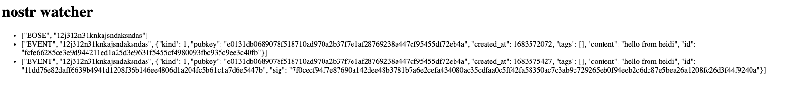

### Questions
- What are some of the challenges you faced while working on Phase 1?

1. I was struggling to write it in Java, I have tried two days to understand how to set up websocket connection in Java but everytime when I send message it terminate the session.
2. In the end, I have decide to submit the code in Javascript as it have a well-developed library in npm
3. As I am new to websocket connection. I am quite lots in the beginning but in the end I have summerize the step I need to do. create websocket connection > serialized event > send event
4. In Javascript I dont need to write up the serialization detail but but I was looking that into Java I learnt a lot on SHA256 hashing.

- What kind of failures do you expect to a project such as DISTRISE to encounter?

1. How would the event aggregator behave when there are massive message coming in and how that pass message to User's own relay.
2. Single failure point on Event aggregator. If it goes down, then means all of the even will get lost?
3. If any of the relay stop updating, shall we inform user?
4. if user relay goes down, means we dont end the connection safely, how will nostr server behave?

# Phase 2

### Task
build nostr relay server for DISTRISE. Relays must accept events from clients and provide ways for people to filter events through subscriptions.

### Deliverable
- I have created a nostr relay endpoint on `ws://localhost:8081/myHandler`
- spin up application and bring up the UI on `http://localhost:8081/myHandlerWatcher.html`. This page is showing all of the event sent to /myHandler
- In NostrController file, cahange the connection destination to `ws://localhost:8081/myHandler` and run the application
- after spin up application need to call `http://localhost:8081/nostr/connect` to subscribe to relay
- after subscribe to relay, need to call `http://localhost:8081/nostr/hello` to send message to relay
- check on `http://localhost:8081/myHandlerWatcher.html`, to make sure message been sent

### Questions
- Why did you choose this database?

I choose MySQL because this project is quite small we might distribute it but it wont we a project with big scale. As for now, I choose to use something I am familiar with and easy to configure. If this project get to the stage which will be distributed in a large scale. will consider some other database like CockroachDB or Cassandra.

- If the number of events to be stored will be huge, what would you do to scale the database?

I will use Multi-Primary strategy which been natively supported on MySQL. As its a social media platform, I will assume that the number of write event will be huge. I need to make sure every node can accept write.

# Phase 3

### Task
build a Event Aggregator and fetch events from a sinfle relat and store them in your database of choice

### Deliverable
- After spin up application, call `http://localhost:8081/nostr/agg/connect` to allow event aggregator to connect to relay: wss://relay.nekolicio.us
- After connect to the relat, call `http://localhost:8081/nostr/agg/subscribe` to subscribe message coming from that relay
- Once received message from relay, it will be stored in MySQL database

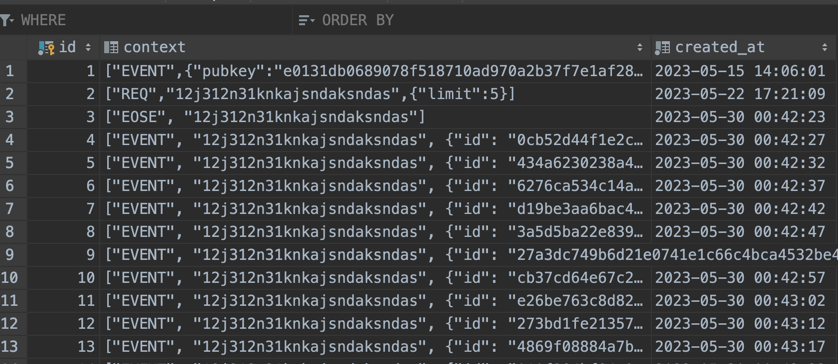

### Questions
- Why did you choose this database? Is it the same or different database as the one you used in Phase 2? Why is it the same or a different one?

I am still using the database as I havent seen issue by processing all of the data coming from 1 relay.

- If the number of events to be stored will be huge, what would you do to scale the database?

MySQL do provide a Multi-Primary strategy which can be used to scale the database.

# Phase 4

### Task
Make event aggregator to fetch events from multiple relays,  push them into a Queue of your choice, fetch these events from the Queue system and store them in the database you have chosen in Phase 3.

### Deliverable
- I choose Kafka to be my queue system. I have created a topic called `nostr-topic`
- To make sure this works, need to have a Kafka server running on local machine (will try to run it on docker compose later)
- I have created a KafkaProducer to send message to Kafka topic
- I have created a KafkaConsumer to consume message from Kafka topic and store it in MySQL database
- After subscribe to relay on Phase 3, call `http://localhost:8081/nostr/agg/getAggData` to get the latest 10 data from database

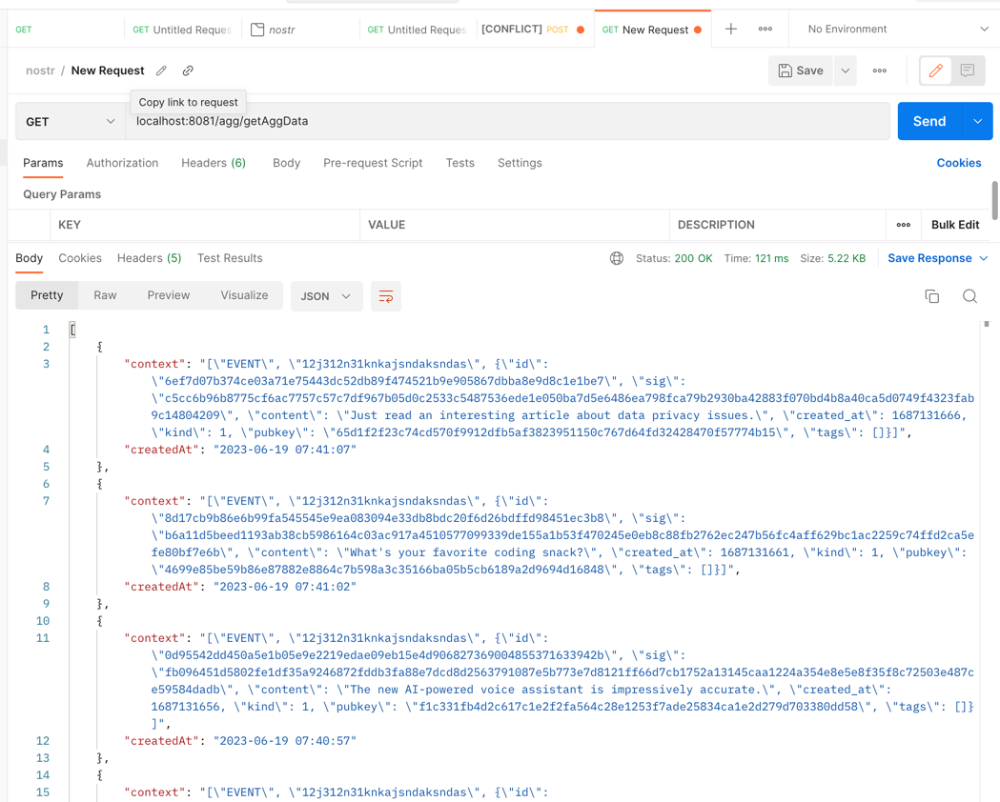

### Questions
- Why did you choose this solution?

I would like to try out Kafka as it been heavly used in my work. I would like to try out this new technology.

- If the number of events to be stored will be huge, what would you do to scale your chosen solution?

I would create partition on the topic and have more consumer to consume the message from the topic. As we dont need to make sure message been saved by time, I think at this point it make sense to start to put message into different partition. When querying data, will just grab data based on the createdAt timestamp.

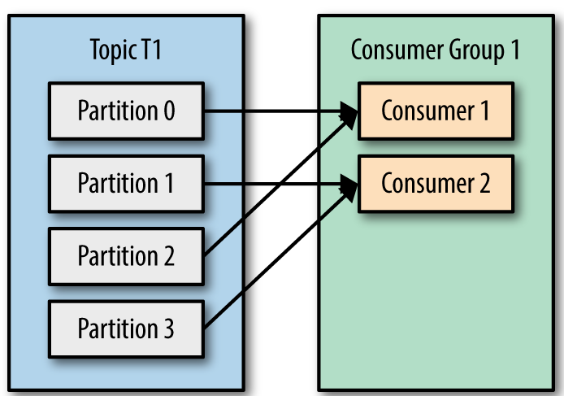

# Phase 5

### Task
set up the instrumentation of the chosen technology

### Deliverable
- prometheus server is running on `http://localhost:9090`
prometheus is used to scrap monitoring data from application. It provide a good overview of the application health and is convidence to used for java/spring boot appication as it will automatically create the metric without adding extra logic in code,
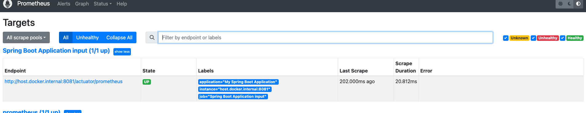
- grafana server is running on `http://localhost:3000`
Once we get the prometheus data, we are able to create a dashboard from grafana. Its easier than viewing it directly from prometheus UI
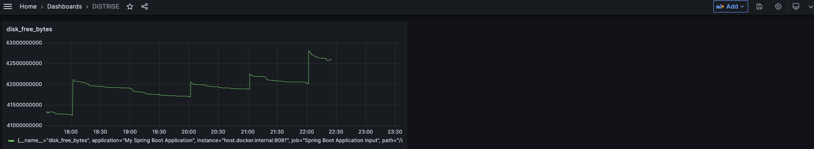

### Questions
- Why did you choose these 5 metrics? & What kind of errors or issues do you expect them to help you monitor?

1. process_cpu_usage: CPU usage for the process
This will help me understand the cpu usage of my process. If the cpu usage is high, I will need to scale up the server to make sure it can handle the load. 
If user report failure or slowness for the http response. I will check this one to make sure my application still in a healthy state.
you can see in below chart it takes a lot of cpu usage to start up the application
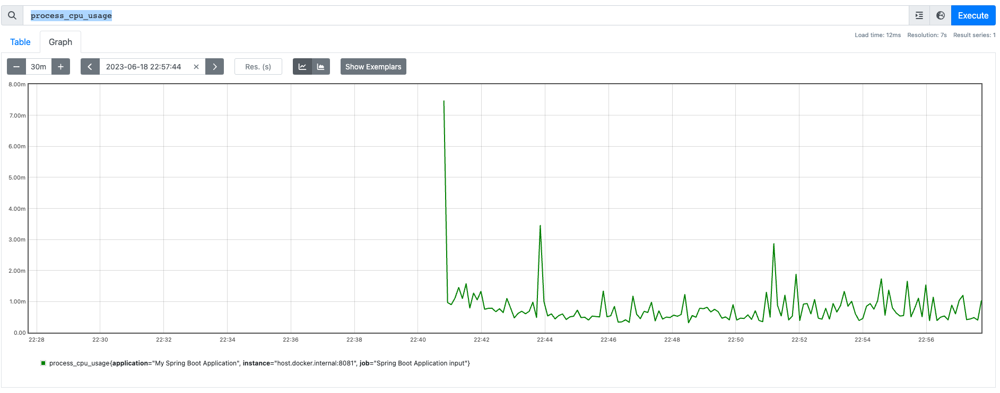
2. jvm_memory_used_bytes: Memory usage for different memories
For java application, it is important to monitor the memory usage. If the memory usage is high, it might cause the application to crash. This chart also provide a good overview of different memories
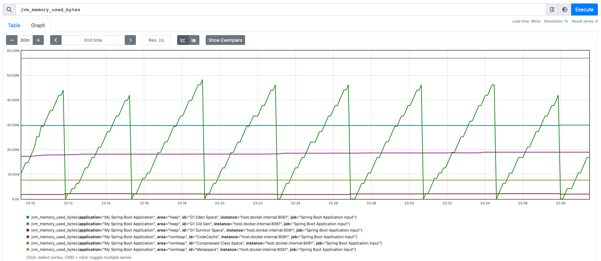
3. rate(http_server_requests_seconds_count[1m]): represents the number of request coming in
This will help me understand the traffic of my application. If the traffic is high, I will need to make sure my application can handle the load.
This can also helps me to monitor which endpoint been call more often/which one never been used. I can use this to remove the endpoint which never been used and understand better the user behavior.
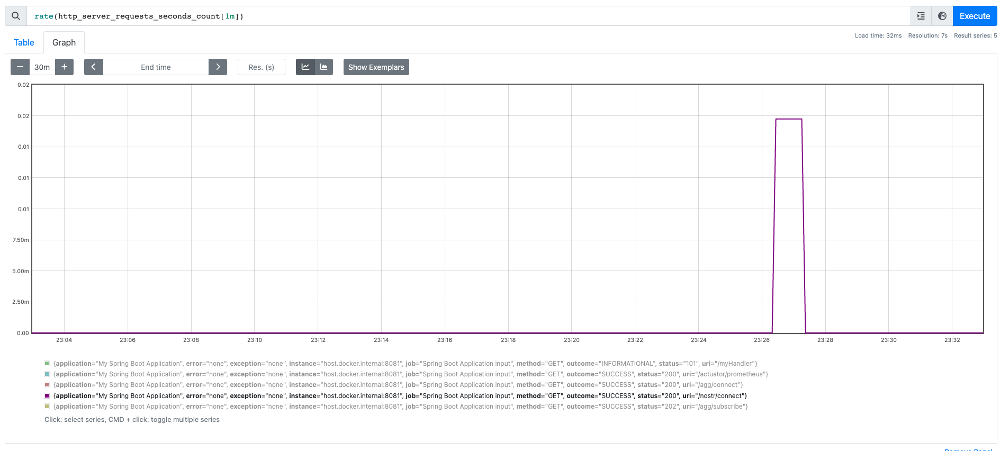
4. spring_kafka_listener_seconds_max: represents the maximum execution time in seconds for Spring Kafka Consumer
This will help me understand the performance of my Kafka consumer, make sure it can still process the message when the load is high.
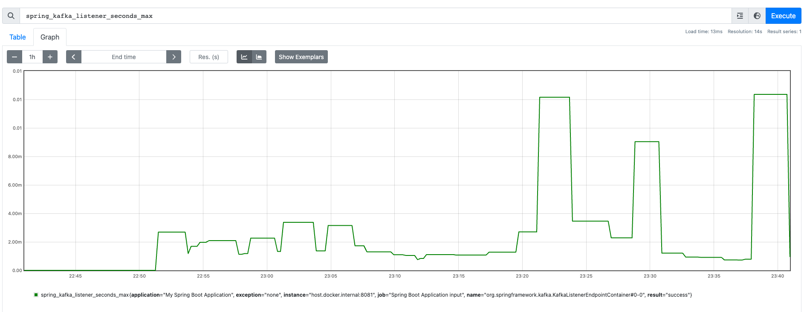
5. spring_kafka_template_seconds_max: represents the maximum execution time in seconds for Spring Kafka producer
This will help me understand the performance of my Kafka producer, make sure it can still process the message when the load is high.
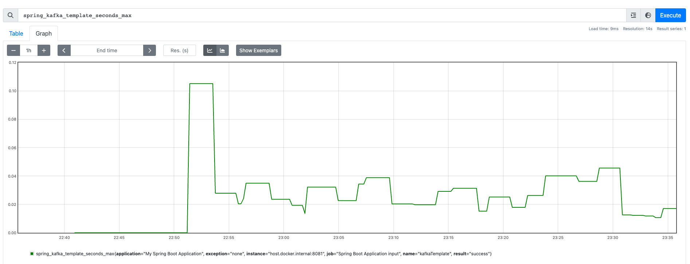
For point 4&5 these are good indicator for me to consider to have topic partition and spin up more consumer and set up consumer group to handle the load.

- If you had more time, what other tools would you use or metrics would you instrument and why?
I will try to set up opentelemetry so that I can set up the trace for my HTTP request.
Might also playaround Kibana and ElasticSearch to see if I can get more insight from the log.